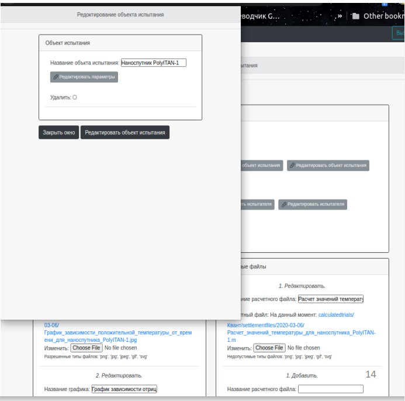

# Информационной системы моделирования испытаний в тепловакуумном стенде космических аппаратов

***

## Описание

Была создана информационная система, которая обеспечивает систематизированное хранение результатов моделируемых испытаний КА и предоставляет по запросу пользователя информацию о результатах испытания. В ИС предусмотрена возможность ограничения доступа к данным в зависимости от роли пользователя.

Роли пользователя: _«Администратор»_, _«Редактор»_, _«Сотрудник»_.

Разработано программное обеспечение системы в виде WEB-интерфейса базы данных. В качестве языка программирования выбран _Python_, а фреймворк – _Django_.

В проекте были использованы:
* Python v. 3.7.5
* Django v. 3.0.6
* HTML и CSS
* фреймворк Bootstrap 4
* Javascript и пакет Jquerry
* PostgreSQL

---

## База данных

База данных – реляционная состоит из 14 таблиц: Стенды, Объекты испытания, Экспериментальные испытания, Расчетные испытания, Параметры стенда, Документации, схемы стенда, Параметры объекта испытания, Технические отчеты и отчетные документации, Испытатели, ОИ экспериментального испытания, Испытатели экспериментального испытания, Испытатели расчетного испытания, Графики, Расчетные файлы.

---

## Структура программного обеспечения

*	_manage.py_ – скрипт, который позволяет взаимодействовать с проектом Django, также запускает локальный сервер для разработки.
* Внутренний каталог _diplom/_ – это папка сайта.
* Внутренний каталог _account/_ – это папка приложения пользователей.
* Внутренний каталог _calculatedtrials/_ – это папка приложения расчетных испытаний.
* Внутренний каталог _generaltables/_ – это папка приложения дополнительных таблиц для испытаний.
* Внутренний каталог _stands/_ – это папка приложения стендов.
* Внутренний каталог _trials/_ – это папка приложения экспериментальных испытаний.
* Внутренний каталог _static/_ – это пакет, в которой хранятся статические файлы для сайта, например, css-файлы, js-файлы.
* Внутренний каталог _media/_ – это папка, в которую загружаются файлы при взаимодействии пользователя с формами для загрузки файлов в БД.
* Внутренний каталог _templates/_ – это папка, в которой хранятся шаблоны (html-файлы), для отображения данных на сайте.

---

## Интерфейс

_Главная страница_

_Страница стендов для редактора ИС_

_Страница расчетных испытаний_

_Страница конкретного расчетного испытания_

_Страница удаления испытания_

_Форма для редактирования Объекта испытания_

_Страница сотрудника ИС_

